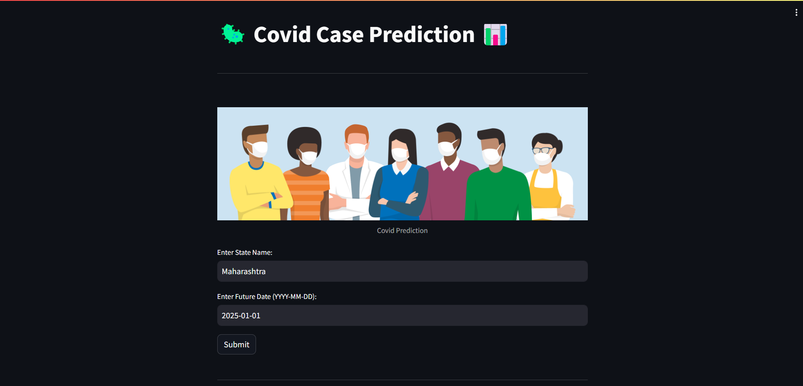

# Covid Stats Predictor 


To empower users with a tool that not only predicts future COVID-19 statistics but also provides a visually engaging and insightful representation of the data through the integration of Tableau.


## Description


This project focuses on predicting future COVID-19 statistics for specific states using a Long Short-Term Memory (LSTM) model implemented with TensorFlow/Keras. The application, built with Streamlit, allows users to input a state name and a future date, and it provides predictions for confirmed cases, recovery cases, and deaths. Additionally, the project integrates Tableau for detailed data visualization, showcasing a dynamic dashboard with insights into the COVID-19 data.
## Key Features

1. LSTM Model: Utilizes a machine learning model based on LSTM architecture to predict future COVID-19 statistics.
2. Streamlit Interface: User-friendly interface for inputting state and date, displaying predictions, and offering additional analysis options.
3. Tableau Integration: Embeds a Tableau visualization to provide users with a detailed analysis and insights into the COVID-19 data.
## Technologies Used

* Streamlit for the web application interface.
* TensorFlow/Keras for building and training the LSTM model.
* Tableau for data visualization and analysis.
## Deployment

To run this project on Google Colab 

 1. Upload the following files on colab notebook 
 *  app.py
 * covid_virus_dataset.csv 
 * entire_model.joblib
 * scaler.pkl

 2. In the notebook Run the following commands - 

 

```bash
  !pip install streamlit -q 
```

```bash
  !wget -q -O - ipv4.icanhazip.com
```

```bash 
  !streamlit run app.py & npx localtunnel --port 8501
```


For detailed process refer to the following video : 

https://youtu.be/ZZsyxIWdCko?si=rfT1Rz4p3e8LNKlu


## Screenshots 



